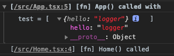
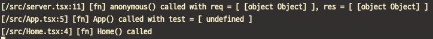

# babel-plugin-logger
[![NPM version][npm-image]][npm-url] [![Build Status][travis-image]][travis-url] [![Dependency Status][daviddm-image]][daviddm-url] [![Coverage percentage][coveralls-image]][coveralls-url]
> 🚀 babel-plugin to automatically insert logging code 🚀

## Transform

```js
/* BEFORE */

function multiply(n) {
    try { } catch (e) {
    
    }

    return n * n
}

class A {
    division(a, b) {
        return a / b
    }
}

/* AFTER (automatically insert logging code by babel-plugin-logger) */

function multiply(n) {
    console.log('[/path/file.js:1]', '[fn] multiply() called with', 'n = [ ' + n + ' ]');
    
    try {} catch (e) {
        console.error('[/path/file.js:3]', '[fn] multiply() catch with', 'e = [ ' + e + ' ]');
    }
    
    return n * n;
}

class A {
    division(a, b) {
        console.log('[/path/file.js:10]', '[A] division() called with', 'a = [ ' + a + ' ],', 'b = [ ' + b + ' ]');
        return a / b;
    }
}
```

## Sample

▼ group log template in browser



▼ default log template in command line



## Installation

```bash
npm i -D babel-plugin-logger
# or
yarn add -D babel-plugin-logger
```

## Setup


babel.config.js
```js
module.exports = function (api) {
    return {
        "plugins": [ "logger" ]
    }
}
```

.babelrc
```json
{
    "plugins": [
        "logger"
    ]
}
```

## ToDo

We welcome contributions to babel-plugin-logger in many forms

- [ ] Enable custom logging such as winston or bunyan or any logger through [`require`](./src/options.ts#L26) option
- [ ] Add a description of the [options](./src/options.ts#L25) to the README.md
- [ ] Any feature you suggest!

## License

[MIT © Ryan Yang](./LICENSE)


[npm-image]: https://badge.fury.io/js/babel-plugin-logger.svg
[npm-url]: https://npmjs.org/package/babel-plugin-logger
[travis-image]: https://travis-ci.org/wickedev/babel-plugin-logger.svg?branch=master
[travis-url]: https://travis-ci.org/wickedev/babel-plugin-logger
[daviddm-image]: https://david-dm.org/wickedev/babel-plugin-logger.svg?theme=shields.io
[daviddm-url]: https://david-dm.org/wickedev/babel-plugin-logger
[coveralls-image]: https://coveralls.io/repos/wickedev/babel-plugin-logger/badge.svg
[coveralls-url]: https://coveralls.io/r/wickedev/babel-plugin-logger
